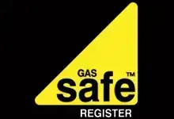

[FM Heating Specialist](https://fmheatingspecialist.co.uk/)
===========================================================

FM Heating Specialist – Gas Boiler Servicing, Installations and Repairs around the Caerphilly Area

Boiler Installations
--------------------

FM Heating Specialist offers Gas Boiler services, installation and repairs. Also, Installing log fires, cookers, warm air units, range cookers in and around the Caerphilly Area. Power-flushing, system upgrades and landlord inspections, emergency repair work to central heating boilers, systems and pipework.

[Our Services](https://fmheatingspecialist.co.uk/#services) [Contact](https://fmheatingspecialist.co.uk/#contact)

Features
--------

#### Customer Service

>  I take pride in my work and aim to provide exceptional customer service.

#### Your Property

Protecting the customers property is paramount.

#### Exceptional Service

> You can expect the same exceptional service that you would from my previous employer and their engineers

[](https://www.gassaferegister.co.uk/BusinessCompetencies?ep=5T3yICJxSbfKANaXUW4ejW5ARLuLmGN7cFGMnjXFwaO4pDDmC5uw2IhwyDR4uxsmRg2f8TCJ4cFJ6AIcgH8wAraBMQ9gn2bE1E2fCdUw6sQhzKAyQZWpKhyyNpB62bW2bB51l&cp=8dbTCMJeQPJDla2btm2cGo0z3okSrvgEal7O2bBBidEQXKu2KMzsFjsk2fM5W2LtsH6&backurl=2fCheckBusinessResults3fcp3d8dbTCMJeQPJDla25252btm2cGo0z3okSrvgEal7O25252bBBidEQXKu2KMzsFjsk25252fM5W2LtsH6&searchurl=2FCheckBusinessResults3Fcp3D8dbTCMJeQPJDla25252btm2cGo0z3okSrvgEal7O25252bBBidEQXKu2KMzsFjsk25252fM5W2LtsH6 "Gas Safe Register")

#### [Gas Safe Register](https://www.gassaferegister.co.uk/BusinessCompetencies?ep=5T3yICJxSbfKANaXUW4ejW5ARLuLmGN7cFGMnjXFwaO4pDDmC5uw2IhwyDR4uxsmRg2f8TCJ4cFJ6AIcgH8wAraBMQ9gn2bE1E2fCdUw6sQhzKAyQZWpKhyyNpB62bW2bB51l&cp=8dbTCMJeQPJDla2btm2cGo0z3okSrvgEal7O2bBBidEQXKu2KMzsFjsk2fM5W2LtsH6&backurl=2fCheckBusinessResults3fcp3d8dbTCMJeQPJDla25252btm2cGo0z3okSrvgEal7O25252bBBidEQXKu2KMzsFjsk25252fM5W2LtsH6&searchurl=2FCheckBusinessResults3Fcp3D8dbTCMJeQPJDla25252btm2cGo0z3okSrvgEal7O25252bBBidEQXKu2KMzsFjsk25252fM5W2LtsH6 "Gas Safe Register")

About Us
--------

I’m Ashley of FM Heating Specialist, Ex British Gas Technical Engineer, qualified in Natural Gas and LPG.

I’m a Technical Engineer for 14 Years with British Gas. Now Self Employed since April 2021 and serving the South Wales Valleys.

Qualified in Domestic Natural Gas and LPG, I have gained my Solar Thermal and Solid fuel and Biomass (HETAS) qualifications this August 2021.

Our Services
------------

Check our [Terms and conditions](https://fmheatingspecialist.co.uk/terms-and-conditions/) for further information.

#### Installation

Installation and repairs for Boilers, fires, cookers, warm air units, range cookers.

#### Power Flushing

Power-flushing, Magnetic Filter installations and system upgrades.

#### Landlord Inspections

Landlords/Home owner inspections and safety certificates also know as CP12s.

#### Emergency Repair Work

Emergency repair work to central heating boilers, systems and pipework.

##### Would like to know more

Get in touch
------------

### FM Heating Specialist

Ystrad Mynach, Caerphilly

[07917 198605](tel:07917 198605)

[fmheating@outlook.com](mailto:fmheating@outlook.com)